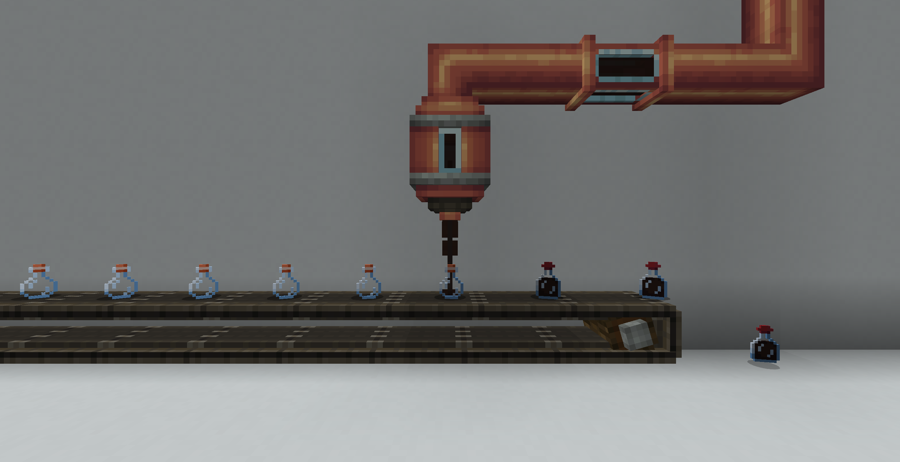
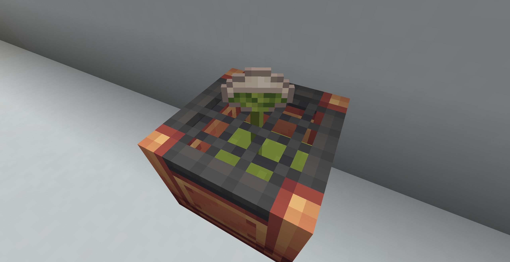
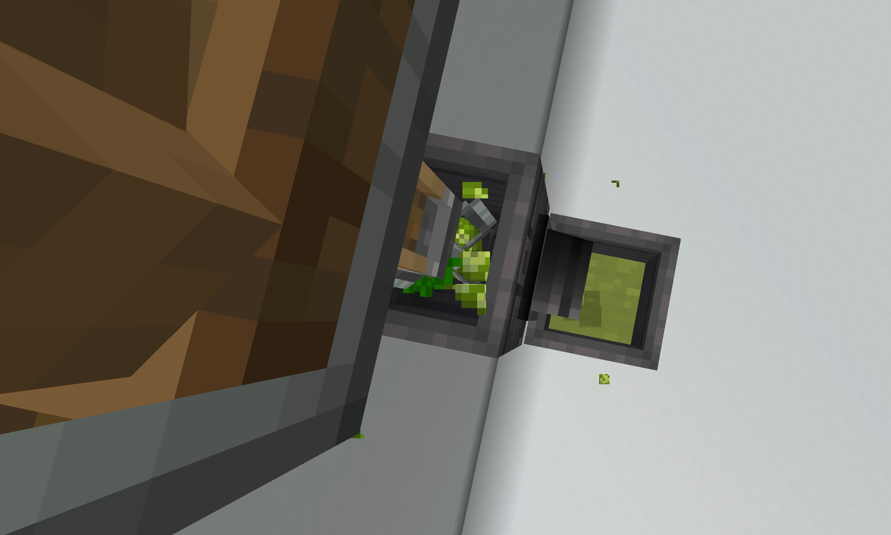
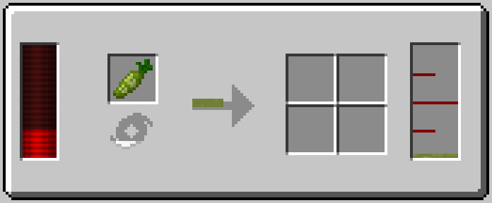
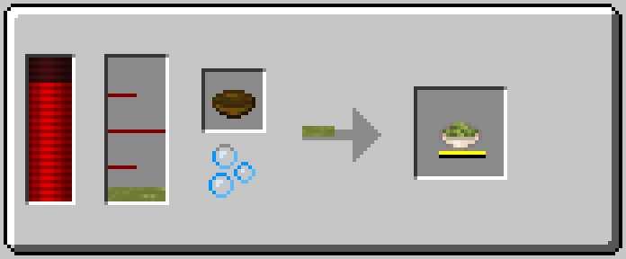
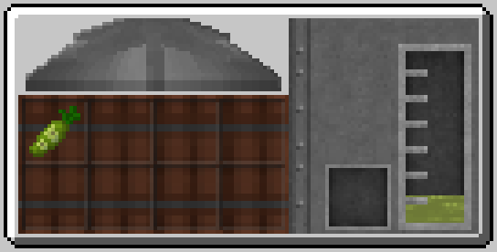
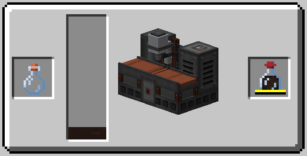

# SushiGoFluids
Added fluid support to some items in Sushi Go Crafting.
## License
MIT
## Dependencies
- Minecraft 1.20.1
- Forge Mod Loader
- Sushi Go Crafting
## Recipe Compatibility
### Create
- Filling by Spout
  
- Item Draining
  
- Mixing
  
### Thermal Expansion
- Centrifugal Separator
  
- Fluid Encapsulator
  
### Immersive Engineering
- Industrial Squeezer
  
- Bottling Machine
  